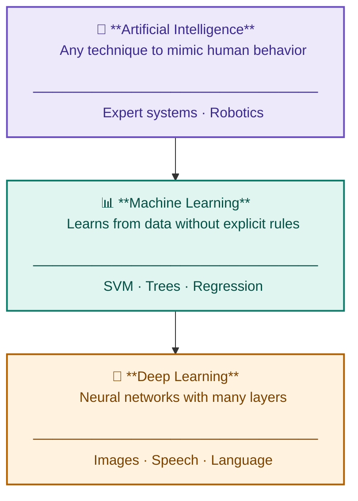
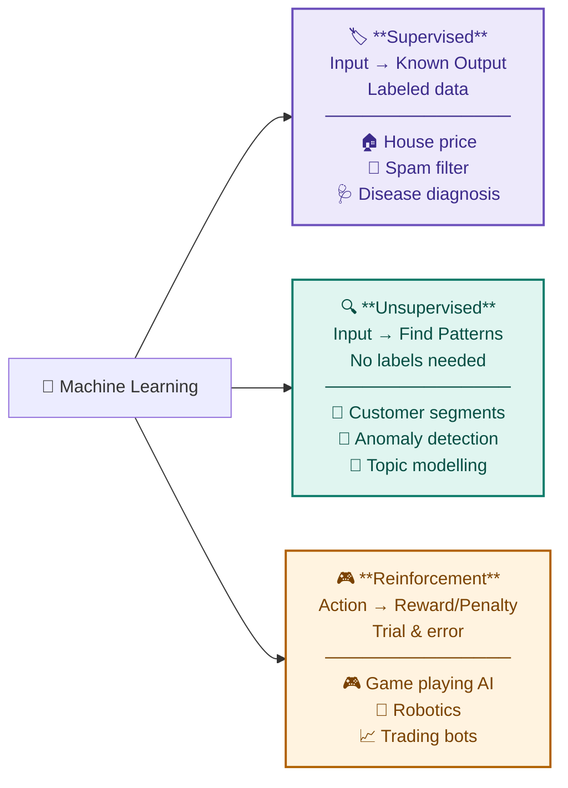
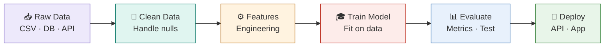
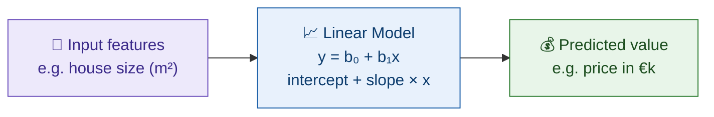
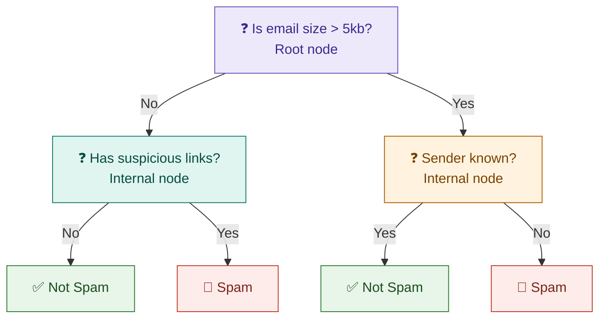
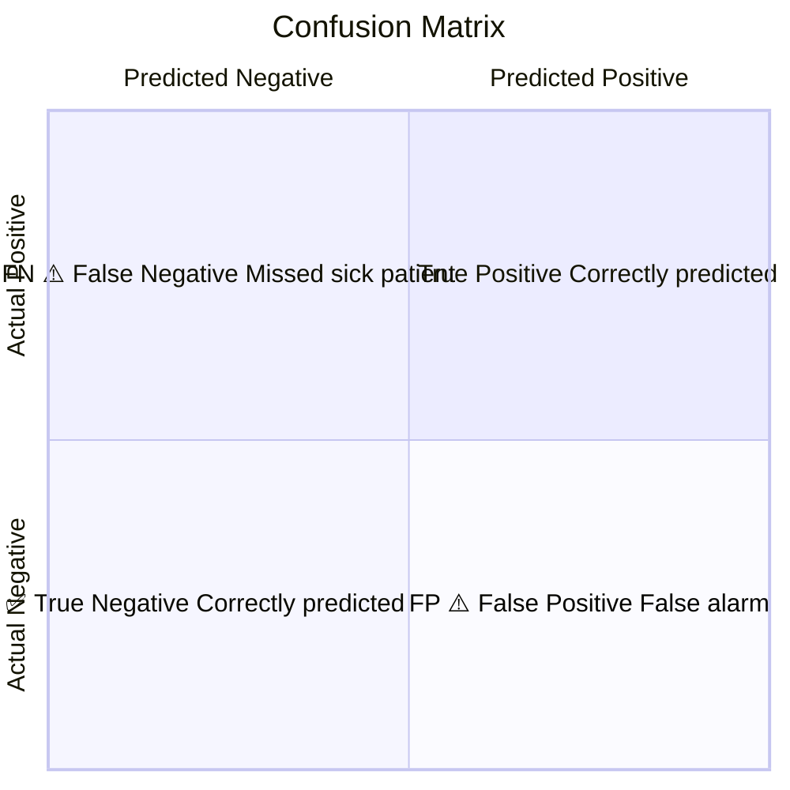
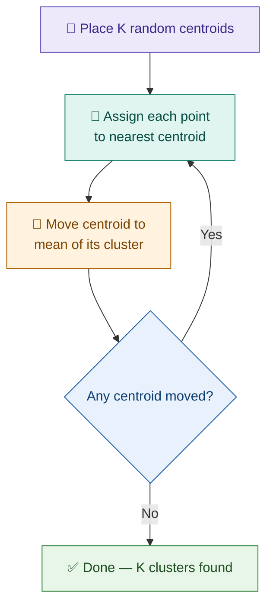
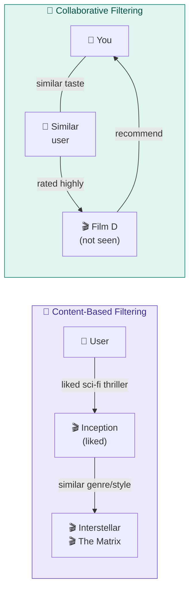

# Course 1 — Machine Learning with Python

**Course MOC:** [[AI_ML_MOC]] · **Next module:** [[02_Deep_Learning_Keras]]
**Visual reference:** [[IBM_Course1_StudyNotes.html|🎨 Original HTML version]]

---

## 01 · What is Machine Learning?

> **Feynman check** — "We show the computer thousands of examples. It finds the pattern. Then it can guess on data it has never seen — without us writing the rules."

### Diagram — AI, ML & Deep Learning



### Diagram — 3 Types of Machine Learning



### Diagram — The ML Pipeline



### Key Vocabulary

| Term | Definition |
|---|---|
| `Feature` | An input variable (column) — e.g. house size, age |
| `Label / Target` | The output we want to predict — e.g. price, category |
| `Training set` | Data used to fit the model (~70–80%) |
| `Test set` | Held-out data to evaluate performance (~20–30%) |
| `Overfitting` | Model memorises training data, fails on new data |
| `Underfitting` | Model too simple, misses the real pattern |

---

## 02 · Regression

Predicts a **continuous numerical value** — price, temperature, salary, score.

### Diagram — Linear Regression



> **Intuition** — fits a straight line through a scatter of points, minimising the distance between the line and each data point. More features = multiple linear regression, more dimensions, same idea.

### Evaluation Metrics

| Metric | Formula | Meaning |
|---|---|---|
| `MAE` | mean(\|actual − predicted\|) | Average absolute error, easy to interpret |
| `MSE` | mean((actual − predicted)²) | Penalises large errors heavily |
| `RMSE` | √MSE | Same units as the target variable |
| `R²` | 1 − SS_res / SS_tot | % of variance explained. 1 = perfect, 0 = useless |

### Code — scikit-learn

```python
# scikit-learn — Linear Regression
from sklearn.linear_model import LinearRegression
from sklearn.metrics import r2_score, mean_squared_error

model = LinearRegression()
model.fit(X_train, y_train)
y_pred = model.predict(X_test)

print(f"R² = {r2_score(y_test, y_pred):.3f}")
```

---

## 03 · Classification

Predicts a **discrete category** — spam/not spam, disease/healthy, cat/dog.

### Diagram — Decision Tree (simplified)



### Diagram — Confusion Matrix



> **Key insight** — Accuracy is misleading on imbalanced classes. A model that always predicts "healthy" gets 99% accuracy if only 1% of patients are sick — but catches zero actual cases.

### Classification metrics

| Metric | Formula | When to use |
|---|---|---|
| `Accuracy` | Correct / Total | Balanced classes only |
| `Precision` | TP / (TP + FP) | When false alarms are costly |
| `Recall` | TP / (TP + FN) | When missing a case is costly (e.g. medical) |
| `F1 Score` | 2 × (P × R) / (P + R) | Balance between precision and recall |

### Algorithms covered

| Algorithm | How it works | Wikilink |
|---|---|---|
| KNN | Majority vote of K nearest points | [[k_nearest_neighbors]] |
| Decision Tree | Series of yes/no questions | [[decision_trees]] |
| Logistic Regression | Outputs probability (despite the name) | [[logistic_regression]] |
| SVM | Finds optimal separating boundary | [[support_vector_machines]] |

---

## 04 · Clustering

**Unsupervised** — groups similar data with no labels. Algorithm finds structure on its own.

### Diagram — K-Means Clustering (K=3)



> **Choosing K** — use the **elbow method**: plot inertia (within-cluster distance) vs K. The "elbow" point where the curve flattens = optimal K. Beyond it, more clusters give diminishing returns.

### Algorithms compared

| Algorithm | Shape of clusters | Needs K? | Handles noise? |
|---|---|---|---|
| [[k_means]] | Spherical | Yes | No |
| [[hierarchical_clustering]] | Any (tree) | No | Partly |
| [[dbscan]] | Arbitrary | No | Yes |

---

## 05 · Recommender Systems

Suggest items to users based on patterns.

### Diagram — Content-Based vs Collaborative Filtering



> **Cold start problem** — new users or items have no history, so collaborative filtering can't recommend anything. Workaround: use content-based filtering until enough data is gathered.

| Approach | Based on | Limitation |
|---|---|---|
| Content-based | Item features | Misses serendipity, stays in a "bubble" |
| Collaborative filtering | User similarity | Cold start problem |
| Hybrid | Both | More complex but more robust |

---

## 🧠 Self-Quiz — Test Yourself

> Try answering out loud before reading the answers. Feynman method.

**Q1 · What is the difference between [[supervised_learning]] and [[unsupervised_learning]]?**
> Supervised uses labeled data — the model learns from known input→output pairs. Unsupervised uses unlabeled data — the model finds hidden patterns with no predefined answers.

**Q2 · R² = 0.85 — what does this mean?**
> The model explains 85% of the variance in the target variable. The remaining 15% is unexplained noise or factors not captured by the features.

**Q3 · Medical test for a rare disease — Precision or Recall matters most? Why?**
> Recall matters most. Missing a real sick patient (false negative) is more dangerous than a false alarm. You'd rather over-alert and investigate than miss a case.

**Q4 · What happens in K-Means if you choose K too large?**
> The model overfits — clusters become too granular and stop representing meaningful groups. Points may end up in their own cluster, losing all insight.

**Q5 · What is the "cold start problem" in recommenders?**
> When a new user or item has no history, collaborative filtering cannot make recommendations. Content-based filtering is a common workaround — it uses item features, not user history.

**Q6 · Name 3 signs your model is overfitting.**
> ① Very high training accuracy but low test accuracy. ② Model performs perfectly on known data but poorly on new samples. ③ Overly complex model with too many parameters relative to dataset size.

**Q7 · What does the elbow method tell you?**
> It helps choose the optimal K in clustering. Plot inertia (within-cluster distance) vs K — pick the point where the curve bends. Beyond this, more clusters give diminishing returns.

---

## 📝 Confusion Log

*Things that confused me and how I resolved them — add entries here.*

| What confused me | How I resolved it | Date |
|---|---|---|
| | | |

---

## Open questions to revisit

- How does [[gradient_descent]] (preview from [[02_Deep_Learning_Keras]]) connect to fitting these regression models?
- When exactly does [[polynomial_regression]] start overfitting?

---

## Concept wikilinks in this note

[[supervised_learning]] · [[unsupervised_learning]] · [[reinforcement_learning]]
[[linear_regression]] · [[logistic_regression]] · [[decision_trees]]
[[k_nearest_neighbors]] · [[support_vector_machines]]
[[k_means]] · [[hierarchical_clustering]] · [[dbscan]]
[[confusion_matrix]] · [[gradient_descent]] · [[neural_network]]

---

## Source materials

- Coursera: IBM AI Engineering — Course 1
- Local folder: `learning/IBM_AI_Engineering/01_ML_with_Python/`
- Projects: `01_ML_with_Python/04_Projects/`
